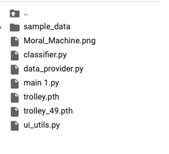

# Exercise 12

## Installation & Usage

1. Unzip the folder
2. Upload the file trolley.ipynb to google colab
3. Drag and drop all remaining files into the root folder in colab
   1. You can ignore the auto generated smaple_data folder
4. You should now be able to use the notebook as intended

**You can optionally activate a GPU-Runtime Google-Colab, but it is not required**

**Be aware of the fact, that additional files can be deleted by colab if you close the runtime**

### Your upload folder should look something like this

